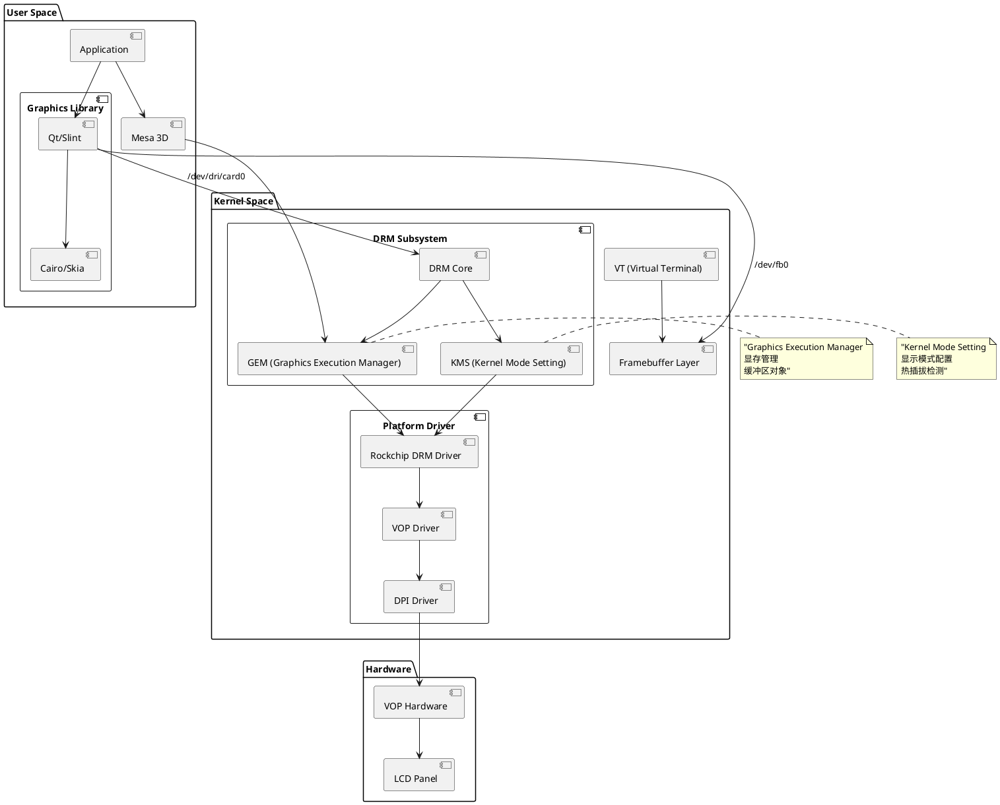
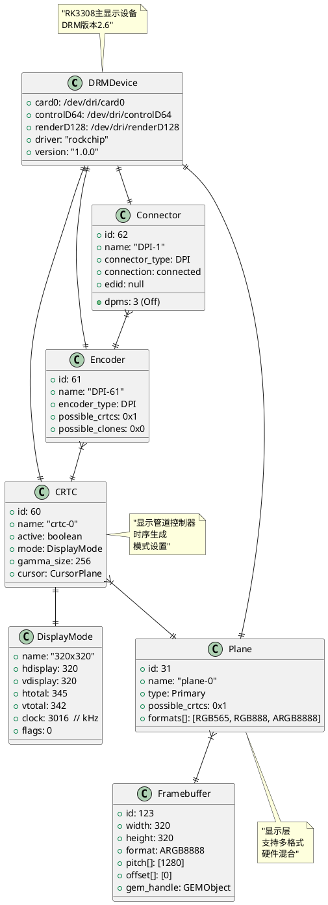
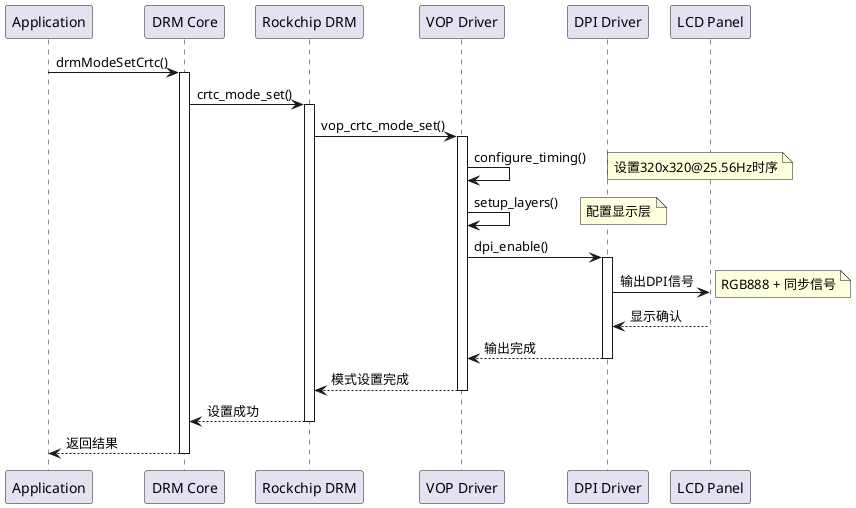
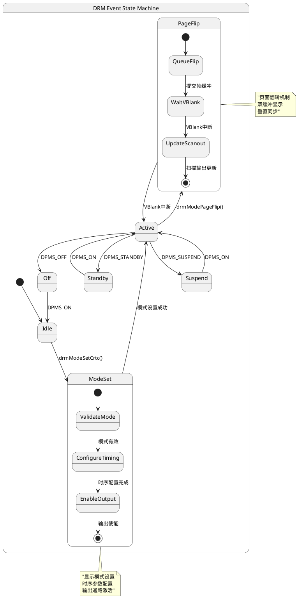
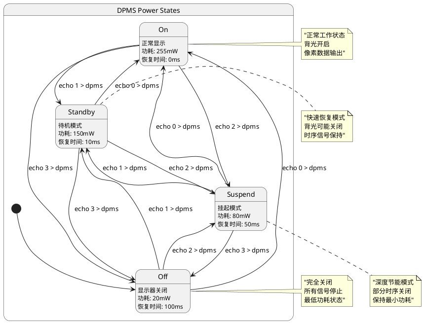
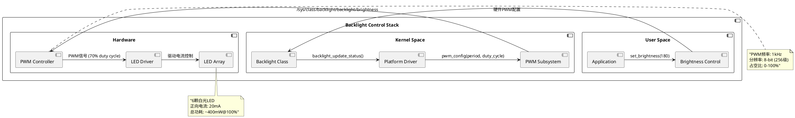

# Display

## 📋 目录

- [1. 显示硬件规格](#1-显示硬件规格)
- [2. 显示控制器架构](#2-显示控制器架构)
- [3. 系统显示栈](#3-系统显示栈)
- [4. DRM/KMS子系统](#4-drmkms子系统)
- [5. 显示时序与信号](#5-显示时序与信号)
- [6. 设备节点与接口](#6-设备节点与接口)
- [7. 电源管理](#7-电源管理)
- [8. 硬件调试工具](#8-硬件调试工具)

---

## 1. 显示硬件规格

### 1.1 LCD面板详细规格

| 参数类别 | 参数名称 | 规格值 | 技术说明 |
|----------|----------|--------|----------|
| **物理特性** | 分辨率 | 320 × 320 像素 | 方形显示，1:1宽高比 |
| | 物理尺寸 | 32mm × 34mm | 对角线约1.34英寸 |
| | 像素密度 | ~254 PPI | 高密度显示 |
| | 显示技术 | TFT-LCD | 薄膜晶体管液晶显示 |
| **电气特性** | 工作电压 | 3.3V ±0.3V | 标准CMOS电平 |
| | 功耗 | 150mW (典型) | 不含背光 |
| | 背光功耗 | 80mW (典型) | LED背光 |
| | 启动时间 | 100ms | 上电到稳定显示 |
| **接口特性** | 接口类型 | DPI (24-bit RGB) | 并行接口 |
| | 刷新率 | 25.56 Hz | 低功耗设计 |
| | 像素时钟 | 3.015784 MHz | 计算值 |
| | 同步信号 | 负极性 | HSYNC/VSYNC |

### 1.2 显示控制器硬件架构

```plantuml
@startuml DisplayControllerArchitecture

package "Rockchip RK3308 SoC" {
    component "ARM Cortex-A35 Quad Core" as CPU {
        port cpu_if
    }
    
    component "AXI System Bus" as AXI {
        port cpu_port
        port vop_port
        port memory_port
    }
    
    component "DDR3 Memory Controller" as DDR {
        port axi_port
        port ddr_pins
    }
    
    component "VOP (Video Output Processor)" as VOP {
        component "Display Controller" as DC
        component "Layer Compositor" as LC  
        component "Color Space Converter" as CSC
        component "Scaler" as SCL
        port axi_if
        port dpi_if
    }
    
    component "Clock & Reset Unit" as CRU {
        port vop_clk
        port dpi_clk
    }
    
    component "Power Management Unit" as PMU {
        port power_ctrl
    }
}

package "External Components" {
    component "DDR3 SDRAM" as RAM {
        port ddr_interface
    }
    
    component "320x320 LCD Panel" as LCD {
        port dpi_interface
        component "TFT Matrix" as TFT
        component "Driver IC" as Driver
        component "LED Backlight" as Backlight
    }
    
    component "Backlight Controller" as BL_CTRL {
        port pwm_in
        port led_out
    }
}

' 连接关系
CPU::cpu_if --> AXI::cpu_port
VOP::axi_if --> AXI::vop_port  
DDR::axi_port --> AXI::memory_port
CRU::vop_clk --> VOP
CRU::dpi_clk --> VOP::dpi_if
PMU::power_ctrl --> VOP
VOP::dpi_if --> LCD::dpi_interface
DDR::ddr_pins --> RAM::ddr_interface
BL_CTRL::led_out --> LCD::Backlight

note top of VOP : "Video Output Processor\n支持多层混合\n硬件缩放\n格式转换"
note right of LCD : "320×320 TFT-LCD\n24-bit RGB接口\nLED背光"

@enduml
```

### 1.3 VOP内部架构

```plantuml
@startuml VOPInternalArchitecture

package "VOP (Video Output Processor)" {
    component "AXI Master Interface" as AXI_IF {
        port read_channel
        port write_channel
    }
    
    component "Layer Processing Pipeline" {
        component "Layer 0 (Primary)" as L0 {
            component "Format Decoder" as FD0
            component "Color Space Convert" as CSC0
            component "Scaler" as SCL0
        }
        
        component "Layer 1 (Overlay)" as L1 {
            component "Format Decoder" as FD1  
            component "Alpha Blending" as AB1
        }
        
        component "Layer 2 (Cursor)" as L2 {
            component "Cursor Controller" as CC2
        }
    }
    
    component "Display Compositor" as COMP {
        component "Alpha Compositor" as AC
        component "Dithering Engine" as DE
        component "Gamma Correction" as GC
    }
    
    component "Display Timing Generator" as DTG {
        component "CRTC Controller" as CRTC
        component "Timing Generator" as TG
        component "FIFO Controller" as FIFO
    }
    
    component "DPI Output Interface" as DPI_OUT {
        port hsync_out
        port vsync_out  
        port de_out
        port pclk_out
        port rgb_data[23:0]
    }
}

' 数据流连接
AXI_IF::read_channel --> L0::FD0
AXI_IF::read_channel --> L1::FD1
AXI_IF::read_channel --> L2::CC2

L0::SCL0 --> COMP::AC
L1::AB1 --> COMP::AC
L2::CC2 --> COMP::AC

COMP::GC --> DTG::FIFO
DTG::TG --> DPI_OUT

note right of DTG : "时序生成器\n320x320@25.56Hz\n支持DPMS电源管理"
note bottom of COMP : "支持Alpha混合\n伽马校正\n抖动处理"

@enduml
```

---

## 2. 显示控制器架构

### 2.1 VOP功能模块详解

#### 2.1.1 Layer Processing Pipeline
```
Layer 0 (Primary Layer):
- 支持RGB565/RGB888/ARGB8888格式
- 硬件缩放支持 (1/8 to 8x)
- YUV到RGB色彩空间转换
- 最大分辨率: 4096×4096

Layer 1 (Overlay Layer):  
- 支持RGB格式和部分YUV格式
- Alpha混合处理
- 支持色彩键透明
- 最大分辨率: 2048×2048

Layer 2 (Cursor Layer):
- 专用光标层
- 支持ARGB格式
- 硬件加速移动
- 最大尺寸: 128×128
```

#### 2.1.2 Display Timing Generator
```
CRTC功能:
- 显示时序生成 (HSYNC/VSYNC)
- 像素时钟分频
- Display Enable信号生成
- DPMS电源状态控制

支持的显示模式:
- 最小分辨率: 64×64
- 最大分辨率: 4096×2304  
- 刷新率范围: 24Hz - 120Hz
- 当前配置: 320×320@25.56Hz
```

### 2.2 DPI接口电气规范

| 信号名称 | 方向 | 电平标准 | 频率/时序 | 功能描述 |
|----------|------|----------|-----------|----------|
| **PCLK** | Output | CMOS 3.3V | 3.015784 MHz | 像素时钟 |
| **HSYNC** | Output | CMOS 3.3V | 74.0 Hz | 水平同步(负极性) |
| **VSYNC** | Output | CMOS 3.3V | 25.56 Hz | 垂直同步(负极性) |
| **DE** | Output | CMOS 3.3V | - | 数据使能信号 |
| **R[7:0]** | Output | CMOS 3.3V | 3.015784 MHz | 红色数据线 |
| **G[7:0]** | Output | CMOS 3.3V | 3.015784 MHz | 绿色数据线 |
| **B[7:0]** | Output | CMOS 3.3V | 3.015784 MHz | 蓝色数据线 |

### 2.3 时钟域架构

```plantuml
@startuml ClockDomainArchitecture

component "System Clock Sources" {
    component "24MHz Crystal" as XTAL {
        port xtal_out
    }
    
    component "PLL0 (CPLL)" as PLL0 {
        port pll0_out
    }
    
    component "PLL1 (GPLL)" as PLL1 {
        port pll1_out
    }
}

component "Clock & Reset Unit (CRU)" {
    component "Clock Mux & Divider" as MUX_DIV {
        port clk_in[4]
        port vop_aclk
        port vop_dclk
        port vop_hclk
    }
    
    component "Reset Controller" as RST_CTRL {
        port reset_out
    }
}

component "VOP Clock Domains" {
    component "AXI Clock Domain" as AXI_CLK {
        note right: "100MHz\nAXI总线时钟"
    }
    
    component "Display Clock Domain" as DPI_CLK {
        note right: "3.015784MHz\n像素时钟"
    }
    
    component "APB Clock Domain" as APB_CLK {
        note right: "50MHz\n寄存器访问"
    }
}

' 时钟连接
XTAL::xtal_out --> PLL0
XTAL::xtal_out --> PLL1
PLL0::pll0_out --> MUX_DIV::clk_in
PLL1::pll1_out --> MUX_DIV::clk_in

MUX_DIV::vop_aclk --> AXI_CLK
MUX_DIV::vop_dclk --> DPI_CLK  
MUX_DIV::vop_hclk --> APB_CLK

note bottom of MUX_DIV : "时钟分频计算:\nPLL1(1200MHz) ÷ 398 = 3.015784MHz"

@enduml
```

---

## 3. 系统显示栈

### 3.1 Linux显示子系统架构



### 3.2 DRM对象模型



---

## 4. DRM/KMS子系统

### 4.1 KMS显示管道



### 4.2 DRM事件处理流程



---

## 5. 显示时序与信号

### 5.1 详细时序参数

| 时序类型 | 参数名 | 值 | 单位 | 说明 |
|----------|--------|----|----- |------|
| **水平时序** | H_ACTIVE | 320 | pixels | 有效显示像素 |
| | H_FRONT_PORCH | 5 | pixels | 水平前肩 |
| | H_SYNC_WIDTH | 10 | pixels | 水平同步宽度 |
| | H_BACK_PORCH | 10 | pixels | 水平后肩 |
| | H_TOTAL | 345 | pixels | 水平总像素数 |
| **垂直时序** | V_ACTIVE | 320 | lines | 有效显示行数 |
| | V_FRONT_PORCH | 5 | lines | 垂直前肩 |
| | V_SYNC_WIDTH | 7 | lines | 垂直同步宽度 |
| | V_BACK_PORCH | 10 | lines | 垂直后肩 |
| | V_TOTAL | 342 | lines | 垂直总行数 |
| **同步信号** | H_SYNC_POL | 负极性 | - | 水平同步极性 |
| | V_SYNC_POL | 负极性 | - | 垂直同步极性 |
| | DE_POL | 正极性 | - | 数据使能极性 |

### 5.2 时序计算公式

```
像素时钟计算:
Pixel_Clock = H_TOTAL × V_TOTAL × Refresh_Rate
            = 345 × 342 × 25.56
            = 3,015,784 Hz
            ≈ 3.016 MHz

水平频率计算:
H_Frequency = Pixel_Clock ÷ H_TOTAL
            = 3,015,784 ÷ 345
            = 8,741 Hz
            ≈ 8.74 kHz

帧时间计算:
Frame_Time = 1 ÷ Refresh_Rate
           = 1 ÷ 25.56
           = 39.12 ms

行时间计算:
Line_Time = 1 ÷ H_Frequency  
          = 1 ÷ 8,741
          = 114.4 μs
```

### 5.3 信号时序图

```plantuml
@startuml SignalTimingDiagram

robust "PCLK" as PCLK
robust "HSYNC" as HSYNC  
robust "VSYNC" as VSYNC
robust "DE" as DE
robust "RGB_DATA" as RGB

@0
PCLK is 0
HSYNC is 1
VSYNC is 1  
DE is 0
RGB is "Black"

@10
PCLK is 1

@20  
PCLK is 0
HSYNC is 0
note bottom : "水平同步开始 (负极性)"

@30
PCLK is 1

@40
PCLK is 0

@100
HSYNC is 1
note bottom : "水平同步结束"

@150
DE is 1
RGB is "Pixel_Data"
note bottom : "有效像素数据开始"

@200
PCLK is 1

@210
PCLK is 0

@3200
DE is 0
RGB is "Black"
note bottom : "有效像素数据结束"

@3300
VSYNC is 0
note bottom : "垂直同步开始 (负极性)"

@3400
VSYNC is 1
note bottom : "垂直同步结束"

@enduml
```

---

## 6. 设备节点与接口

### 6.1 设备文件系统映射

```
系统设备节点结构:

/dev/dri/
├── card0           # 主显示设备
│   ├── 权限: crw-rw---- root:video (226, 0)
│   ├── 功能: DRM主设备节点
│   └── 接口: DRM_IOCTL_*
├── controlD64      # DRM控制设备  
│   ├── 权限: crw-rw---- root:video (226, 64)
│   ├── 功能: 特权DRM操作
│   └── 接口: 模式设置、资源分配
└── renderD128      # 渲染设备
    ├── 权限: crw-rw---- root:video (226, 128)  
    ├── 功能: GPU渲染(软件模拟)
    └── 接口: GEM缓冲区管理

/dev/
└── fb0             # 传统帧缓冲设备
    ├── 权限: crw-rw---- root:video (29, 0)
    ├── 功能: 直接帧缓冲访问
    ├── 大小: 320×320×4 = 409,600 字节
    └── 格式: ARGB8888
```

### 6.2 sysfs接口详解

```
显示相关的sysfs接口:

/sys/class/drm/
├── card0/
│   ├── dev                 # 设备号 "226:0"
│   ├── device -> ../../../platform/ff450000.vop/
│   └── subsystem -> ../../drm/
├── card0-DPI-1/           # DPI连接器
│   ├── status             # connected/disconnected
│   ├── enabled            # 连接器使能状态
│   ├── dpms               # 电源管理状态
│   └── edid               # EDID数据(通常为空)
└── version                # DRM版本信息

/sys/class/backlight/
└── backlight/             # 背光控制
    ├── brightness         # 当前亮度 (0-255)
    ├── max_brightness     # 最大亮度值
    ├── actual_brightness  # 实际亮度值
    ├── bl_power          # 背光电源状态
    └── type              # 背光类型 "raw"

/sys/class/graphics/
└── fb0/                   # 帧缓冲信息
    ├── bits_per_pixel     # 32
    ├── blank             # 屏幕空白状态
    ├── console           # 控制台状态
    ├── cursor            # 光标控制
    ├── mode              # "U:320x320p-0"
    ├── modes             # 支持的显示模式
    ├── name              # "rockchip-vop"
    ├── pan               # 平移控制
    ├── rotate            # 旋转控制
    ├── state             # 设备状态
    └── virtual_size      # 虚拟尺寸
```

### 6.3 ioctl接口规范

#### DRM设备控制接口
```c
// 主要的DRM ioctl命令
#define DRM_IOCTL_VERSION         DRM_IOR(0x00, struct drm_version)
#define DRM_IOCTL_GET_UNIQUE      DRM_IOR(0x01, struct drm_unique)
#define DRM_IOCTL_GET_MAGIC       DRM_IOR(0x02, struct drm_auth)
#define DRM_IOCTL_IRQ_BUSID       DRM_IOR(0x03, struct drm_irq_busid)

// KMS模式设置接口
#define DRM_IOCTL_MODE_GETRESOURCES    DRM_IOWR(0xA0, struct drm_mode_card_res)
#define DRM_IOCTL_MODE_GETCRTC         DRM_IOWR(0xA1, struct drm_mode_crtc)
#define DRM_IOCTL_MODE_SETCRTC         DRM_IOWR(0xA2, struct drm_mode_crtc)
#define DRM_IOCTL_MODE_CURSOR          DRM_IOWR(0xA3, struct drm_mode_cursor)
#define DRM_IOCTL_MODE_GETGAMMA        DRM_IOWR(0xA4, struct drm_mode_crtc_lut)

// 缓冲区管理接口
#define DRM_IOCTL_MODE_GETFB           DRM_IOWR(0xAD, struct drm_mode_fb_cmd)
#define DRM_IOCTL_MODE_ADDFB           DRM_IOWR(0xAE, struct drm_mode_fb_cmd)
#define DRM_IOCTL_MODE_RMFB            DRM_IOWR(0xAF, unsigned int)
#define DRM_IOCTL_MODE_PAGE_FLIP       DRM_IOWR(0xB0, struct drm_mode_crtc_page_flip)
```

#### 帧缓冲设备接口
```c
// 帧缓冲ioctl命令
#define FBIOGET_VSCREENINFO    0x4600  // 获取可变屏幕信息
#define FBIOPUT_VSCREENINFO    0x4601  // 设置可变屏幕信息  
#define FBIOGET_FSCREENINFO    0x4602  // 获取固定屏幕信息
#define FBIOGETCMAP            0x4604  // 获取颜色映射
#define FBIOPUTCMAP            0x4605  // 设置颜色映射
#define FBIOPAN_DISPLAY        0x4606  // 平移显示
#define FBIO_CURSOR            0x4608  // 光标控制
#define FBIOGET_CON2FBMAP      0x460F  // 控制台到帧缓冲映射
#define FBIOPUT_CON2FBMAP      0x4610  // 设置控制台映射

// 屏幕信息结构
struct fb_var_screeninfo {
    __u32 xres;           // 320 - 可见分辨率
    __u32 yres;           // 320
    __u32 xres_virtual;   // 320 - 虚拟分辨率
    __u32 yres_virtual;   // 320
    __u32 xoffset;        // 0 - 虚拟到可见的偏移
    __u32 yoffset;        // 0
    __u32 bits_per_pixel; // 32 - 每像素位数
    __u32 grayscale;      // 0 - 彩色显示
    // ... 更多字段
};
```

---

## 7. 电源管理

### 7.1 DPMS电源状态

| DPMS状态 | 数值 | 功耗 | 恢复时间 | 说明 |
|----------|------|------|----------|------|
| **On** | 0 | 255mW | 0ms | 正常显示 |
| **Standby** | 1 | 150mW | 10ms | 待机模式 |
| **Suspend** | 2 | 80mW | 50ms | 挂起模式 |
| **Off** | 3 | 20mW | 100ms | 关闭显示 |

### 7.2 电源状态转换图



### 7.3 背光控制系统



---

## 8. 硬件调试工具

### 8.1 DRM调试工具

#### modetest工具使用
```bash
# 安装modetest (如果可用)
apt-get install libdrm-tests

# 显示DRM设备信息
modetest -M rockchip

# 显示连接器信息
modetest -M rockchip -c

# 显示编码器信息  
modetest -M rockchip -e

# 显示平面信息
modetest -M rockchip -p

# 设置显示模式
modetest -M rockchip -s 62:320x320@25.56

# 显示测试图案
modetest -M rockchip -s 62:320x320@25.56 -P 31@60:320x320@XR24

# 输出示例:
'''
Connectors:
id	encoder	status		name		size (mm)	modes	encoders
62	61	connected	DPI-1    	32x34		1	61

CRTCs:
id	fb	pos	size
60	123	(0,0)	(320x320)

Planes:
id	crtc	fb	CRTC x,y	x,y	gamma size	possible crtcs
31	60	123	0,0		0,0	0         	0x00000001
'''
```

#### DRM属性查看
```bash
# 查看CRTC属性
cat /sys/kernel/debug/dri/0/crtc-0/state

# 查看连接器属性  
cat /sys/kernel/debug/dri/0/DPI-1/state

# 查看平面属性
cat /sys/kernel/debug/dri/0/plane-0/state

# 输出示例:
'''
crtc[60]: crtc-0
	enable=1
	active=1
	planes_changed=0
	mode_changed=0
	active_changed=0
	connectors_changed=0
	color_mgmt_changed=0
	plane_mask=1
	connector_mask=4
	encoder_mask=2
	mode: 320x320 25 320 325 335 345 320 325 332 342 0x0 0x5
'''
```

### 8.2 帧缓冲调试

#### fbset工具
```bash
# 显示帧缓冲信息
fbset -i

# 输出示例:
'''
mode "320x320-26"
    # D: 3.016 MHz, H: 8.741 kHz, V: 25.56 Hz
    geometry 320 320 320 320 32
    timings 331564 10 10 10 5 10 7
    accel false
    rgba 8/16,8/8,8/0,8/24
endmode

Frame buffer device information:
    Name        : rockchip-vop
    Address     : 0xdda00000
    Size        : 409600
    Type        : PACKED PIXELS
    Visual      : TRUECOLOR
    XPanStep    : 1
    YPanStep    : 1
    YWrapStep   : 0
    LineLength  : 1280
    Accelerator : No
'''
```

#### 帧缓冲直接操作
```bash
# 清除屏幕(填充黑色)
dd if=/dev/zero of=/dev/fb0 bs=1024 count=400

# 填充红色
perl -E 'print "\xFF\x00\x00\xFF" x (320*320)' > /dev/fb0

# 填充蓝色  
perl -E 'print "\x00\x00\xFF\xFF" x (320*320)' > /dev/fb0

# 显示RGB测试图案
hexdump -C /dev/fb0 | head -20
```

### 8.3 信号测试工具

#### GPIO控制脚本
```bash
#!/bin/bash
# display_signal_test.sh

# 测试背光控制
test_backlight() {
    echo "Testing backlight control..."
    
    for brightness in 0 64 128 192 255; do
        echo $brightness > /sys/class/backlight/backlight/brightness
        echo "Brightness: $brightness"
        sleep 2
    done
}

# 测试DPMS状态
test_dpms() {
    echo "Testing DPMS states..."
    
    states=("0:On" "1:Standby" "2:Suspend" "3:Off")
    
    for state in "${states[@]}"; do
        dpms_val=${state%:*}
        dpms_name=${state#*:}
        
        echo $dpms_val > /sys/class/drm/card0-DPI-1/dpms
        echo "DPMS: $dpms_name"
        sleep 3
    done
    
    # 恢复到On状态
    echo 0 > /sys/class/drm/card0-DPI-1/dpms
}

# 显示时序信息
show_timing_info() {
    echo "Display Timing Information:"
    echo "=========================="
    
    # 从设备树获取时序信息
    if [ -f /sys/kernel/debug/clk/clk_summary ]; then
        grep -E "dclk_vop|aclk_vop" /sys/kernel/debug/clk/clk_summary
    fi
    
    # 显示当前模式
    if [ -f /sys/class/graphics/fb0/mode ]; then
        echo "Current mode: $(cat /sys/class/graphics/fb0/mode)"
    fi
    
    # 显示连接状态
    echo "Connector status: $(cat /sys/class/drm/card0-DPI-1/status)"
    echo "DPMS state: $(cat /sys/class/drm/card0-DPI-1/dpms)"
}

# 主菜单
case "$1" in
    backlight)
        test_backlight
        ;;
    dpms)  
        test_dpms
        ;;
    info)
        show_timing_info
        ;;
    *)
        echo "Usage: $0 {backlight|dpms|info}"
        echo "  backlight - Test backlight brightness levels"
        echo "  dpms      - Test DPMS power states"
        echo "  info      - Show display timing information"
        exit 1
        ;;
esac
```

### 8.4 性能监控脚本

```bash
#!/bin/bash
# display_perf_monitor.sh

monitor_display_performance() {
    echo "Display Performance Monitor"
    echo "=========================="
    
    while true; do
        # 获取当前时间
        timestamp=$(date '+%Y-%m-%d %H:%M:%S')
        
        # VBlank计数器(如果可用)
        vblank_count=""
        if [ -f /sys/class/drm/card0/vblank_count ]; then
            vblank_count=$(cat /sys/class/drm/card0/vblank_count)
        fi
        
        # 帧缓冲状态
        fb_state=$(cat /sys/class/graphics/fb0/state 2>/dev/null || echo "N/A")
        
        # 背光亮度
        brightness=$(cat /sys/class/backlight/backlight/brightness 2>/dev/null || echo "N/A")
        
        # DPMS状态
        dpms=$(cat /sys/class/drm/card0-DPI-1/dpms 2>/dev/null || echo "N/A")
        
        # 内存使用(显存相关)
        mem_info=$(cat /proc/meminfo | grep -E "MemTotal|MemFree" | tr '\n' ' ')
        
        # 输出监控信息
        printf "[%s] VBlank:%s FB:%s Bright:%s DPMS:%s %s\n" \
               "$timestamp" "$vblank_count" "$fb_state" "$brightness" "$dpms" "$mem_info"
        
        sleep 1
    done
}

# 启动监控
monitor_display_performance
```

---

## 📚 参考资料

### 技术规范文档
- [Rockchip RK3308 TRM v1.4](https://rockchip.fr/RK3308%20TRM%20V1.4.pdf)
- [DPI Interface Specification](https://www.mipi.org/specifications/dpi)
- [Linux DRM/KMS Documentation](https://www.kernel.org/doc/html/latest/gpu/drm-kms.html)
- [Linux Framebuffer HOWTO](https://tldp.org/HOWTO/Framebuffer-HOWTO/)

### 内核文档
- [DRM Driver Development](https://www.kernel.org/doc/html/latest/gpu/drm-internals.html)
- [KMS Properties](https://www.kernel.org/doc/html/latest/gpu/drm-kms-helpers.html)
- [Linux Input Subsystem](https://www.kernel.org/doc/html/latest/input/index.html)

### 开源项目
- [libdrm](https://gitlab.freedesktop.org/mesa/drm) - DRM用户空间库
- [kmscube](https://gitlab.freedesktop.org/mesa/kmscube) - KMS测试工具
- [rockchip-linux](https://github.com/rockchip-linux) - Rockchip Linux支持
