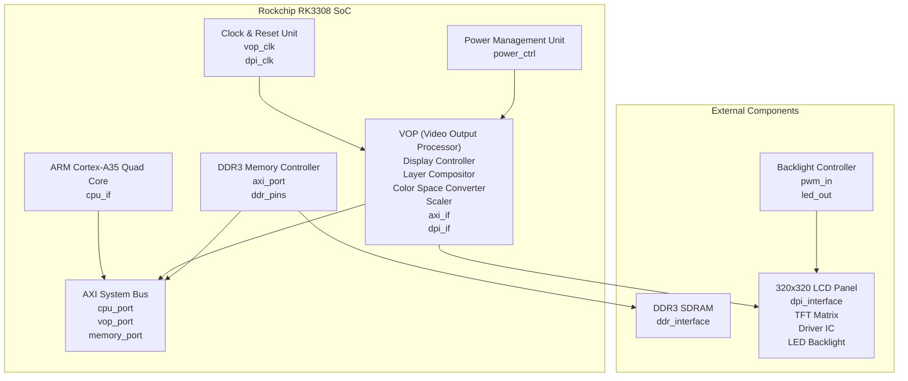
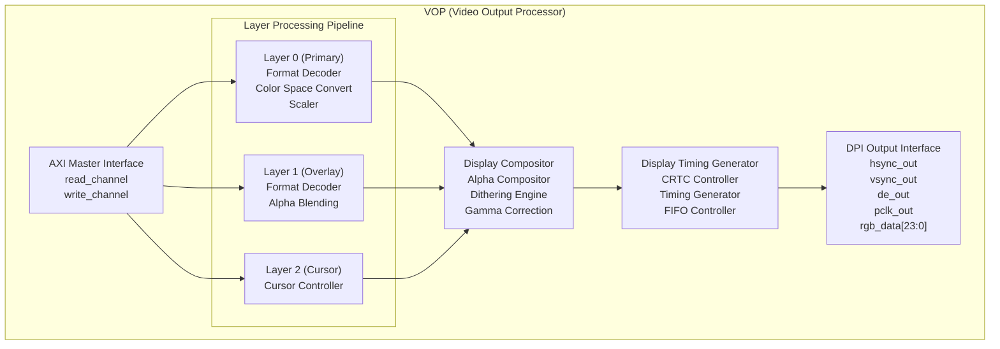
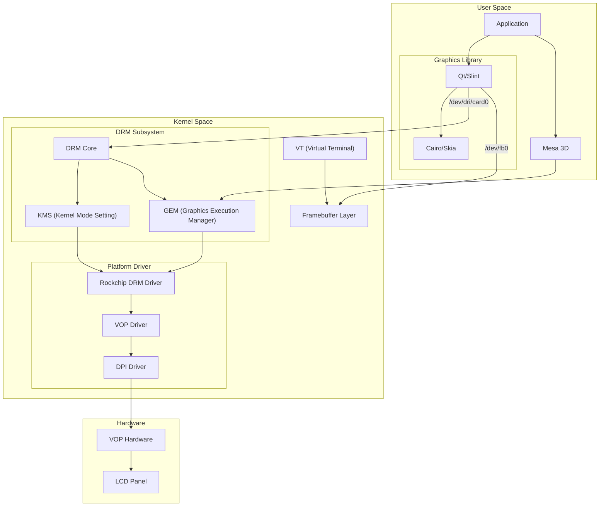
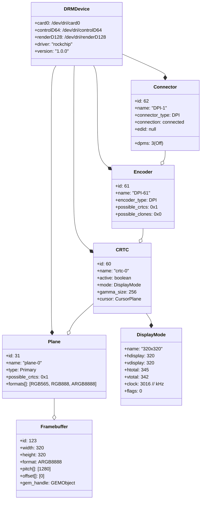
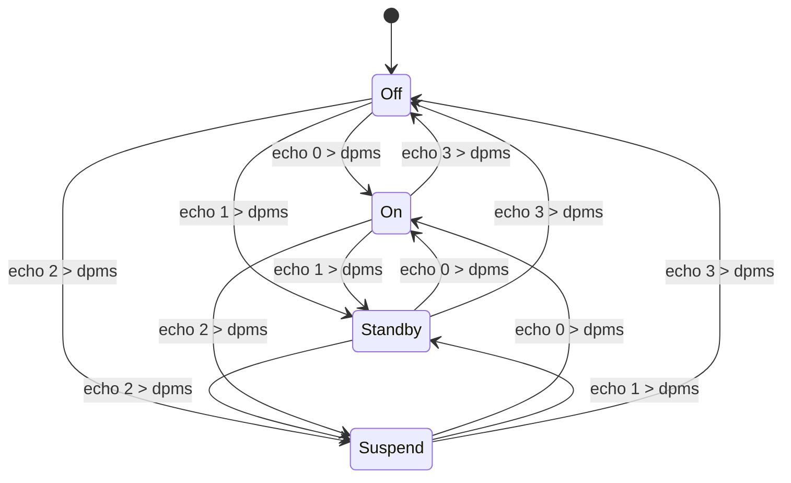

# Display

## 📋 目录

[TOC]

---

## 1. 显示硬件规格

### 1.1 LCD面板详细规格

| 参数类别 | 参数名称 | 规格值 | 技术说明 |
|----------|----------|--------|----------|
| **物理特性** | 分辨率 | 320 × 320 像素 | 方形显示，1:1宽高比 |
| | 物理尺寸 | 32mm × 34mm | 对角线约1.34英寸 |
| | 像素密度 | ~254 PPI | 高密度显示 |
| | 显示技术 | TFT-LCD | 薄膜晶体管液晶显示 |
| **电气特性** | 工作电压 | 3.3V ±0.3V | 标准CMOS电平 |
| | 功耗 | 150mW (典型) | 不含背光 |
| | 背光功耗 | 80mW (典型) | LED背光 |
| | 启动时间 | 100ms | 上电到稳定显示 |
| **接口特性** | 接口类型 | DPI (24-bit RGB) | 并行接口 |
| | 刷新率 | 25.56 Hz | 低功耗设计 |
| | 像素时钟 | 3.015784 MHz | 计算值 |
| | 同步信号 | 负极性 | HSYNC/VSYNC |

### 1.2 显示控制器硬件架构



### 1.3 VOP内部架构



---

## 2. 显示控制器架构

### 2.1 VOP功能模块详解

#### 2.1.1 Layer Processing Pipeline
```
Layer 0 (Primary Layer):
- 支持RGB565/RGB888/ARGB8888格式
- 硬件缩放支持 (1/8 to 8x)
- YUV到RGB色彩空间转换
- 最大分辨率: 4096×4096

Layer 1 (Overlay Layer):  
- 支持RGB格式和部分YUV格式
- Alpha混合处理
- 支持色彩键透明
- 最大分辨率: 2048×2048

Layer 2 (Cursor Layer):
- 专用光标层
- 支持ARGB格式
- 硬件加速移动
- 最大尺寸: 128×128
```

#### 2.1.2 Display Timing Generator
```
CRTC功能:
- 显示时序生成 (HSYNC/VSYNC)
- 像素时钟分频
- Display Enable信号生成
- DPMS电源状态控制

支持的显示模式:
- 最小分辨率: 64×64
- 最大分辨率: 4096×2304  
- 刷新率范围: 24Hz - 120Hz
- 当前配置: 320×320@25.56Hz
```

### 2.2 DPI接口电气规范

| 信号名称 | 方向 | 电平标准 | 频率/时序 | 功能描述 |
|----------|------|----------|-----------|----------|
| **PCLK** | Output | CMOS 3.3V | 3.015784 MHz | 像素时钟 |
| **HSYNC** | Output | CMOS 3.3V | 74.0 Hz | 水平同步(负极性) |
| **VSYNC** | Output | CMOS 3.3V | 25.56 Hz | 垂直同步(负极性) |
| **DE** | Output | CMOS 3.3V | - | 数据使能信号 |
| **R[7:0]** | Output | CMOS 3.3V | 3.015784 MHz | 红色数据线 |
| **G[7:0]** | Output | CMOS 3.3V | 3.015784 MHz | 绿色数据线 |
| **B[7:0]** | Output | CMOS 3.3V | 3.015784 MHz | 蓝色数据线 |

### 2.3 时钟域架构

```mermaid
graph TD
    subgraph "System Clock Sources"
        XTAL["24MHz Crystal<br/>xtal_out"]
        PLL0["PLL0 (CPLL)<br/>pll0_out"]
        PLL1["PLL1 (GPLL)<br/>pll1_out"]
    end
    
    subgraph "Clock & Reset Unit (CRU)"
        MUX_DIV["Clock Mux & Divider<br/>clk_in[4]<br/>vop_aclk<br/>vop_dclk<br/>vop_hclk"]
        RST_CTRL["Reset Controller<br/>reset_out"]
    end
    
    subgraph "VOP Clock Domains"
        AXI_CLK["AXI Clock Domain<br/>100MHz<br/>AXI总线时钟"]
        DPI_CLK["Display Clock Domain<br/>3.015784MHz<br/>像素时钟"]
        APB_CLK["APB Clock Domain<br/>50MHz<br/>寄存器访问"]
    end
    
    XTAL --> PLL0
    XTAL --> PLL1
    PLL0 --> MUX_DIV
    PLL1 --> MUX_DIV
    MUX_DIV --> AXI_CLK
    MUX_DIV --> DPI_CLK
    MUX_DIV --> APB_CLK
```



---

## 3. 系统显示栈

### 3.1 Linux显示子系统架构



### 3.2 DRM对象模型



---

## 4. DRM/KMS子系统

### 4.1 KMS显示管道

```mermaid
sequenceDiagram
    participant APP as Application
    participant DRM as DRM Core
    participant RK_DRM as Rockchip DRM
    participant VOP as VOP Driver
    participant DPI as DPI Driver
    participant LCD as LCD Panel

    APP->>DRM: drmModeSetCrtc()
    activate DRM

    DRM->>RK_DRM: crtc_mode_set()
    activate RK_DRM

    RK_DRM->>VOP: vop_crtc_mode_set()
    activate VOP

    VOP->>VOP: configure_timing()
    note right of VOP: 设置320x320@25.56Hz时序

    VOP->>VOP: setup_layers()
    note right of VOP: 配置显示层

    VOP->>DPI: dpi_enable()
    activate DPI

    DPI->>LCD: 输出DPI信号
    note right of LCD: RGB888 + 同步信号

    LCD-->>DPI: 显示确认
    DPI-->>VOP: 输出完成
    deactivate DPI

    VOP-->>RK_DRM: 模式设置完成
    deactivate VOP

    RK_DRM-->>DRM: 设置成功
    deactivate RK_DRM

    DRM-->>APP: 返回结果
    deactivate DRM
```



### 4.2 DRM事件处理流程

```mermaid
stateDiagram-v2
    [*] --> Idle
    
    Idle --> ModeSet : drmModeSetCrtc()
    ModeSet --> Active : 模式设置成功
    
    Active --> PageFlip : drmModePageFlip()
    PageFlip --> Active : VBlank中断
    
    Active --> Standby : DPMS_STANDBY
    Standby --> Active : DPMS_ON
    
    Active --> Suspend : DPMS_SUSPEND
    Suspend --> Active : DPMS_ON
    
    Active --> Off : DPMS_OFF
    Off --> Idle : DPMS_ON
    
    state ModeSet {
        [*] --> ValidateMode
        ValidateMode --> ConfigureTiming : 模式有效
        ConfigureTiming --> EnableOutput : 时序配置完成
        EnableOutput --> [*] : 输出使能
    }
    
    state PageFlip {
        [*] --> QueueFlip
        QueueFlip --> WaitVBlank : 提交帧缓冲
        WaitVBlank --> UpdateScanout : VBlank中断
        UpdateScanout --> [*] : 扫描输出更新
    }
```



---

## 5. 显示时序与信号

### 5.1 详细时序参数

| 时序类型 | 参数名 | 值 | 单位 | 说明 |
|----------|--------|----|----- |------|
| **水平时序** | H_ACTIVE | 320 | pixels | 有效显示像素 |
| | H_FRONT_PORCH | 5 | pixels | 水平前肩 |
| | H_SYNC_WIDTH | 10 | pixels | 水平同步宽度 |
| | H_BACK_PORCH | 10 | pixels | 水平后肩 |
| | H_TOTAL | 345 | pixels | 水平总像素数 |
| **垂直时序** | V_ACTIVE | 320 | lines | 有效显示行数 |
| | V_FRONT_PORCH | 5 | lines | 垂直前肩 |
| | V_SYNC_WIDTH | 7 | lines | 垂直同步宽度 |
| | V_BACK_PORCH | 10 | lines | 垂直后肩 |
| | V_TOTAL | 342 | lines | 垂直总行数 |
| **同步信号** | H_SYNC_POL | 负极性 | - | 水平同步极性 |
| | V_SYNC_POL | 负极性 | - | 垂直同步极性 |
| | DE_POL | 正极性 | - | 数据使能极性 |

### 5.2 时序计算公式

```
像素时钟计算:
Pixel_Clock = H_TOTAL × V_TOTAL × Refresh_Rate
            = 345 × 342 × 25.56
            = 3,015,784 Hz
            ≈ 3.016 MHz

水平频率计算:
H_Frequency = Pixel_Clock ÷ H_TOTAL
            = 3,015,784 ÷ 345
            = 8,741 Hz
            ≈ 8.74 kHz

帧时间计算:
Frame_Time = 1 ÷ Refresh_Rate
           = 1 ÷ 25.56
           = 39.12 ms

行时间计算:
Line_Time = 1 ÷ H_Frequency  
          = 1 ÷ 8,741
          = 114.4 μs
```

### 5.3 信号时序图

```mermaid
graph LR
    subgraph "Time 0"
        PCLK0[PCLK: 0]
        HSYNC0[HSYNC: 1]
        VSYNC0[VSYNC: 1]
        DE0[DE: 0]
        RGB0[RGB: Black]
    end
    
    subgraph "Time 10"
        PCLK10[PCLK: 1]
    end
    
    subgraph "Time 20"
        PCLK20[PCLK: 0]
        HSYNC20["HSYNC: 0 水平同步开始 (负极性)"]
    end
    
    subgraph "Time 100"
        HSYNC100["HSYNC: 1 水平同步结束"]
    end
    
    subgraph "Time 150"
        DE150[DE: 1]
        RGB150["RGB: Pixel_Data 有效像素数据开始"]
    end
    
    subgraph "Time 3200"
        DE3200[DE: 0]
        RGB3200["RGB: Black 有效像素数据结束"]
    end
    
    subgraph "Time 3300"
        VSYNC3300["VSYNC: 0 垂直同步开始 (负极性)"]
    end
    
    subgraph "Time 3400"
        VSYNC3400["VSYNC: 1 垂直同步结束"]
    end
    
    PCLK0 --> PCLK10 --> PCLK20 --> HSYNC20 --> HSYNC100 --> DE150 --> RGB150 --> DE3200 --> RGB3200 --> VSYNC3300 --> VSYNC3400
```



---

## 6. 设备节点与接口

### 6.1 设备文件系统映射

```
系统设备节点结构:

/dev/dri/
├── card0           # 主显示设备
│   ├── 权限: crw-rw---- root:video (226, 0)
│   ├── 功能: DRM主设备节点
│   └── 接口: DRM_IOCTL_*
├── controlD64      # DRM控制设备  
│   ├── 权限: crw-rw---- root:video (226, 64)
│   ├── 功能: 特权DRM操作
│   └── 接口: 模式设置、资源分配
└── renderD128      # 渲染设备
    ├── 权限: crw-rw---- root:video (226, 128)  
    ├── 功能: GPU渲染(软件模拟)
    └── 接口: GEM缓冲区管理

/dev/
└── fb0             # 传统帧缓冲设备
    ├── 权限: crw-rw---- root:video (29, 0)
    ├── 功能: 直接帧缓冲访问
    ├── 大小: 320×320×4 = 409,600 字节
    └── 格式: ARGB8888
```

### 6.2 sysfs接口详解

```
显示相关的sysfs接口:

/sys/class/drm/
├── card0/
│   ├── dev                 # 设备号 "226:0"
│   ├── device -> ../../../platform/ff450000.vop/
│   └── subsystem -> ../../drm/
├── card0-DPI-1/           # DPI连接器
│   ├── status             # connected/disconnected
│   ├── enabled            # 连接器使能状态
│   ├── dpms               # 电源管理状态
│   └── edid               # EDID数据(通常为空)
└── version                # DRM版本信息

/sys/class/backlight/
└── backlight/             # 背光控制
    ├── brightness         # 当前亮度 (0-255)
    ├── max_brightness     # 最大亮度值
    ├── actual_brightness  # 实际亮度值
    ├── bl_power          # 背光电源状态
    └── type              # 背光类型 "raw"

/sys/class/graphics/
└── fb0/                   # 帧缓冲信息
    ├── bits_per_pixel     # 32
    ├── blank             # 屏幕空白状态
    ├── console           # 控制台状态
    ├── cursor            # 光标控制
    ├── mode              # "U:320x320p-0"
    ├── modes             # 支持的显示模式
    ├── name              # "rockchip-vop"
    ├── pan               # 平移控制
    ├── rotate            # 旋转控制
    ├── state             # 设备状态
    └── virtual_size      # 虚拟尺寸
```

### 6.3 ioctl接口规范

#### DRM设备控制接口
```c
// 主要的DRM ioctl命令
#define DRM_IOCTL_VERSION         DRM_IOR(0x00, struct drm_version)
#define DRM_IOCTL_GET_UNIQUE      DRM_IOR(0x01, struct drm_unique)
#define DRM_IOCTL_GET_MAGIC       DRM_IOR(0x02, struct drm_auth)
#define DRM_IOCTL_IRQ_BUSID       DRM_IOR(0x03, struct drm_irq_busid)

// KMS模式设置接口
#define DRM_IOCTL_MODE_GETRESOURCES    DRM_IOWR(0xA0, struct drm_mode_card_res)
#define DRM_IOCTL_MODE_GETCRTC         DRM_IOWR(0xA1, struct drm_mode_crtc)
#define DRM_IOCTL_MODE_SETCRTC         DRM_IOWR(0xA2, struct drm_mode_crtc)
#define DRM_IOCTL_MODE_CURSOR          DRM_IOWR(0xA3, struct drm_mode_cursor)
#define DRM_IOCTL_MODE_GETGAMMA        DRM_IOWR(0xA4, struct drm_mode_crtc_lut)

// 缓冲区管理接口
#define DRM_IOCTL_MODE_GETFB           DRM_IOWR(0xAD, struct drm_mode_fb_cmd)
#define DRM_IOCTL_MODE_ADDFB           DRM_IOWR(0xAE, struct drm_mode_fb_cmd)
#define DRM_IOCTL_MODE_RMFB            DRM_IOWR(0xAF, unsigned int)
#define DRM_IOCTL_MODE_PAGE_FLIP       DRM_IOWR(0xB0, struct drm_mode_crtc_page_flip)
```

#### 帧缓冲设备接口
```c
// 帧缓冲ioctl命令
#define FBIOGET_VSCREENINFO    0x4600  // 获取可变屏幕信息
#define FBIOPUT_VSCREENINFO    0x4601  // 设置可变屏幕信息  
#define FBIOGET_FSCREENINFO    0x4602  // 获取固定屏幕信息
#define FBIOGETCMAP            0x4604  // 获取颜色映射
#define FBIOPUTCMAP            0x4605  // 设置颜色映射
#define FBIOPAN_DISPLAY        0x4606  // 平移显示
#define FBIO_CURSOR            0x4608  // 光标控制
#define FBIOGET_CON2FBMAP      0x460F  // 控制台到帧缓冲映射
#define FBIOPUT_CON2FBMAP      0x4610  // 设置控制台映射

// 屏幕信息结构
struct fb_var_screeninfo {
    __u32 xres;           // 320 - 可见分辨率
    __u32 yres;           // 320
    __u32 xres_virtual;   // 320 - 虚拟分辨率
    __u32 yres_virtual;   // 320
    __u32 xoffset;        // 0 - 虚拟到可见的偏移
    __u32 yoffset;        // 0
    __u32 bits_per_pixel; // 32 - 每像素位数
    __u32 grayscale;      // 0 - 彩色显示
    // ... 更多字段
};
```

---

## 7. 电源管理

### 7.1 DPMS电源状态

| DPMS状态 | 数值 | 功耗 | 恢复时间 | 说明 |
|----------|------|------|----------|------|
| **On** | 0 | 255mW | 0ms | 正常显示 |
| **Standby** | 1 | 150mW | 10ms | 待机模式 |
| **Suspend** | 2 | 80mW | 50ms | 挂起模式 |
| **Off** | 3 | 20mW | 100ms | 关闭显示 |

### 7.2 电源状态转换图



### 7.3 背光控制系统

```mermaid
graph TD
    subgraph "Backlight Control Stack"
        subgraph "User Space"
            APP["Application"]
            BRIGHT_CTRL["Brightness Control"]
        end
        
        subgraph "Kernel Space"
            BL_CLASS["Backlight Class"]
            PLAT_DRV["Platform Driver"]
            PWM["PWM Subsystem"]
        end
        
        subgraph "Hardware"
            PWM_HW["PWM Controller<br/>PWM频率: 1kHz<br/>分辨率: 8-bit (256级)<br/>占空比: 0-100%"]
            LED_DRV["LED Driver"]
            LED_ARRAY["LED Array<br/>6颗白光LED<br/>正向电流: 20mA<br/>总功耗: ~400mW@100%"]
        end
    end
    
    APP -->|"set_brightness(180)"| BRIGHT_CTRL
    BRIGHT_CTRL -->|"/sys/class/backlight/backlight/brightness"| BL_CLASS
    BL_CLASS -->|"backlight_update_status()"| PLAT_DRV
    PLAT_DRV -->|"pwm_config(period, duty_cycle)"| PWM
    PWM -->|"硬件PWM配置"| PWM_HW
    PWM_HW -->|"PWM信号 (70% duty cycle)"| LED_DRV
    LED_DRV -->|"驱动电流控制"| LED_ARRAY
```



---

## 8. 硬件调试工具

### 8.1 DRM调试工具

#### modetest工具使用
```bash
# 安装modetest (如果可用)
apt-get install libdrm-tests

# 显示DRM设备信息
modetest -M rockchip

# 显示连接器信息
modetest -M rockchip -c

# 显示编码器信息  
modetest -M rockchip -e

# 显示平面信息
modetest -M rockchip -p

# 设置显示模式
modetest -M rockchip -s 62:320x320@25.56

# 显示测试图案
modetest -M rockchip -s 62:320x320@25.56 -P 31@60:320x320@XR24

# 输出示例:
'''
Connectors:
id	encoder	status		name		size (mm)	modes	encoders
62	61	connected	DPI-1    	32x34		1	61

CRTCs:
id	fb	pos	size
60	123	(0,0)	(320x320)

Planes:
id	crtc	fb	CRTC x,y	x,y	gamma size	possible crtcs
31	60	123	0,0		0,0	0         	0x00000001
'''
```

#### DRM属性查看
```bash
# 查看CRTC属性
cat /sys/kernel/debug/dri/0/crtc-0/state

# 查看连接器属性  
cat /sys/kernel/debug/dri/0/DPI-1/state

# 查看平面属性
cat /sys/kernel/debug/dri/0/plane-0/state

# 输出示例:
'''
crtc[60]: crtc-0
	enable=1
	active=1
	planes_changed=0
	mode_changed=0
	active_changed=0
	connectors_changed=0
	color_mgmt_changed=0
	plane_mask=1
	connector_mask=4
	encoder_mask=2
	mode: 320x320 25 320 325 335 345 320 325 332 342 0x0 0x5
'''
```

### 8.2 帧缓冲调试

#### fbset工具
```bash
# 显示帧缓冲信息
fbset -i

# 输出示例:
'''
mode "320x320-26"
    # D: 3.016 MHz, H: 8.741 kHz, V: 25.56 Hz
    geometry 320 320 320 320 32
    timings 331564 10 10 10 5 10 7
    accel false
    rgba 8/16,8/8,8/0,8/24
endmode

Frame buffer device information:
    Name        : rockchip-vop
    Address     : 0xdda00000
    Size        : 409600
    Type        : PACKED PIXELS
    Visual      : TRUECOLOR
    XPanStep    : 1
    YPanStep    : 1
    YWrapStep   : 0
    LineLength  : 1280
    Accelerator : No
'''
```

#### 帧缓冲直接操作
```bash
# 清除屏幕(填充黑色)
dd if=/dev/zero of=/dev/fb0 bs=1024 count=400

# 填充红色
perl -E 'print "\xFF\x00\x00\xFF" x (320*320)' > /dev/fb0

# 填充蓝色  
perl -E 'print "\x00\x00\xFF\xFF" x (320*320)' > /dev/fb0

# 显示RGB测试图案
hexdump -C /dev/fb0 | head -20
```

### 8.3 信号测试工具

#### GPIO控制脚本
```bash
#!/bin/bash
# display_signal_test.sh

# 测试背光控制
test_backlight() {
    echo "Testing backlight control..."
    
    for brightness in 0 64 128 192 255; do
        echo $brightness > /sys/class/backlight/backlight/brightness
        echo "Brightness: $brightness"
        sleep 2
    done
}

# 测试DPMS状态
test_dpms() {
    echo "Testing DPMS states..."
    
    states=("0:On" "1:Standby" "2:Suspend" "3:Off")
    
    for state in "${states[@]}"; do
        dpms_val=${state%:*}
        dpms_name=${state#*:}
        
        echo $dpms_val > /sys/class/drm/card0-DPI-1/dpms
        echo "DPMS: $dpms_name"
        sleep 3
    done
    
    # 恢复到On状态
    echo 0 > /sys/class/drm/card0-DPI-1/dpms
}

# 显示时序信息
show_timing_info() {
    echo "Display Timing Information:"
    echo "=========================="
    
    # 从设备树获取时序信息
    if [ -f /sys/kernel/debug/clk/clk_summary ]; then
        grep -E "dclk_vop|aclk_vop" /sys/kernel/debug/clk/clk_summary
    fi
    
    # 显示当前模式
    if [ -f /sys/class/graphics/fb0/mode ]; then
        echo "Current mode: $(cat /sys/class/graphics/fb0/mode)"
    fi
    
    # 显示连接状态
    echo "Connector status: $(cat /sys/class/drm/card0-DPI-1/status)"
    echo "DPMS state: $(cat /sys/class/drm/card0-DPI-1/dpms)"
}

# 主菜单
case "$1" in
    backlight)
        test_backlight
        ;;
    dpms)  
        test_dpms
        ;;
    info)
        show_timing_info
        ;;
    *)
        echo "Usage: $0 {backlight|dpms|info}"
        echo "  backlight - Test backlight brightness levels"
        echo "  dpms      - Test DPMS power states"
        echo "  info      - Show display timing information"
        exit 1
        ;;
esac
```

### 8.4 性能监控脚本

```bash
#!/bin/bash
# display_perf_monitor.sh

monitor_display_performance() {
    echo "Display Performance Monitor"
    echo "=========================="
    
    while true; do
        # 获取当前时间
        timestamp=$(date '+%Y-%m-%d %H:%M:%S')
        
        # VBlank计数器(如果可用)
        vblank_count=""
        if [ -f /sys/class/drm/card0/vblank_count ]; then
            vblank_count=$(cat /sys/class/drm/card0/vblank_count)
        fi
        
        # 帧缓冲状态
        fb_state=$(cat /sys/class/graphics/fb0/state 2>/dev/null || echo "N/A")
        
        # 背光亮度
        brightness=$(cat /sys/class/backlight/backlight/brightness 2>/dev/null || echo "N/A")
        
        # DPMS状态
        dpms=$(cat /sys/class/drm/card0-DPI-1/dpms 2>/dev/null || echo "N/A")
        
        # 内存使用(显存相关)
        mem_info=$(cat /proc/meminfo | grep -E "MemTotal|MemFree" | tr '\n' ' ')
        
        # 输出监控信息
        printf "[%s] VBlank:%s FB:%s Bright:%s DPMS:%s %s\n" \
               "$timestamp" "$vblank_count" "$fb_state" "$brightness" "$dpms" "$mem_info"
        
        sleep 1
    done
}

# 启动监控
monitor_display_performance
```

---

## 📚 参考资料

### 技术规范文档
- [Rockchip RK3308 TRM v1.4](https://rockchip.fr/RK3308%20TRM%20V1.4.pdf)
- [DPI Interface Specification](https://www.mipi.org/specifications/dpi)
- [Linux DRM/KMS Documentation](https://www.kernel.org/doc/html/latest/gpu/drm-kms.html)
- [Linux Framebuffer HOWTO](https://tldp.org/HOWTO/Framebuffer-HOWTO/)

### 内核文档
- [DRM Driver Development](https://www.kernel.org/doc/html/latest/gpu/drm-internals.html)
- [KMS Properties](https://www.kernel.org/doc/html/latest/gpu/drm-kms-helpers.html)
- [Linux Input Subsystem](https://www.kernel.org/doc/html/latest/input/index.html)

### 开源项目
- [libdrm](https://gitlab.freedesktop.org/mesa/drm) - DRM用户空间库
- [kmscube](https://gitlab.freedesktop.org/mesa/kmscube) - KMS测试工具
- [rockchip-linux](https://github.com/rockchip-linux) - Rockchip Linux支持
